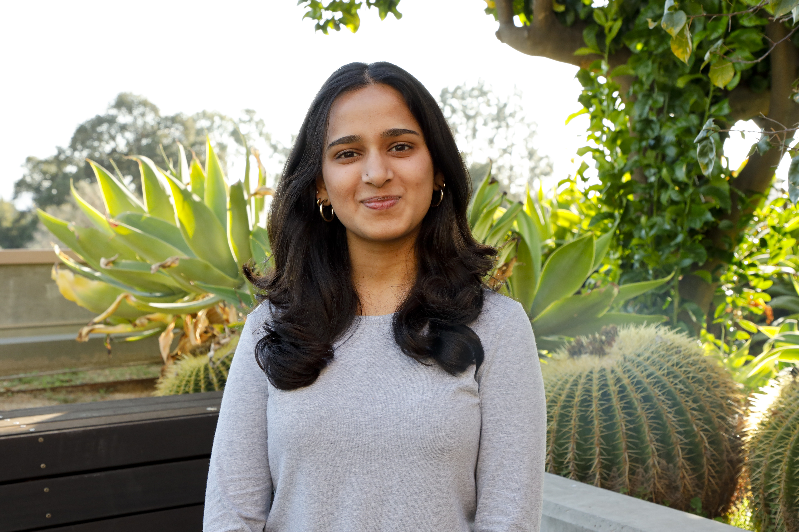

I’m Ishita Raje, an Engineering student at Harvey Mudd College interested in building technologies at the intersection of hardware, computation, and the life sciences.
My experience spans computational modeling, embedded systems, digital design, microfluidics, and hands-on prototyping. I enjoy working across disciplines to turn technical ideas into physical, testable systems.
You can learn more about my work and experience on my [LinkedIn](www.linkedin.com/in/ishita-raje).

---

