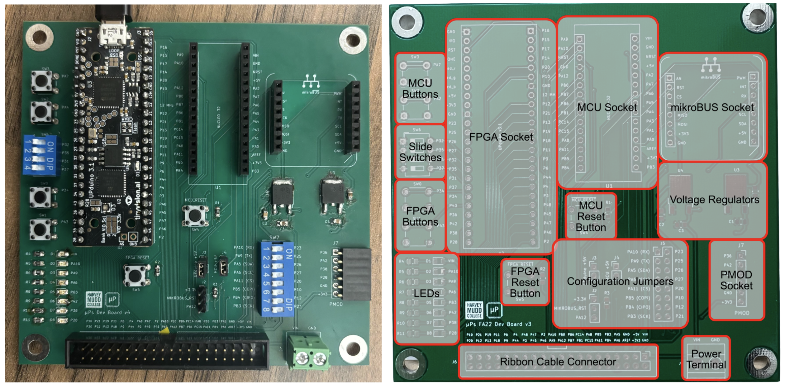
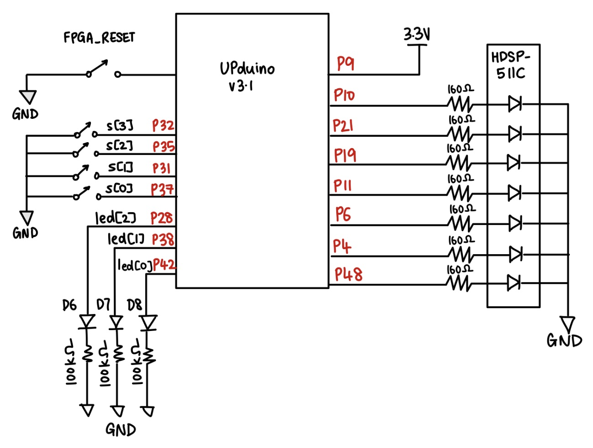
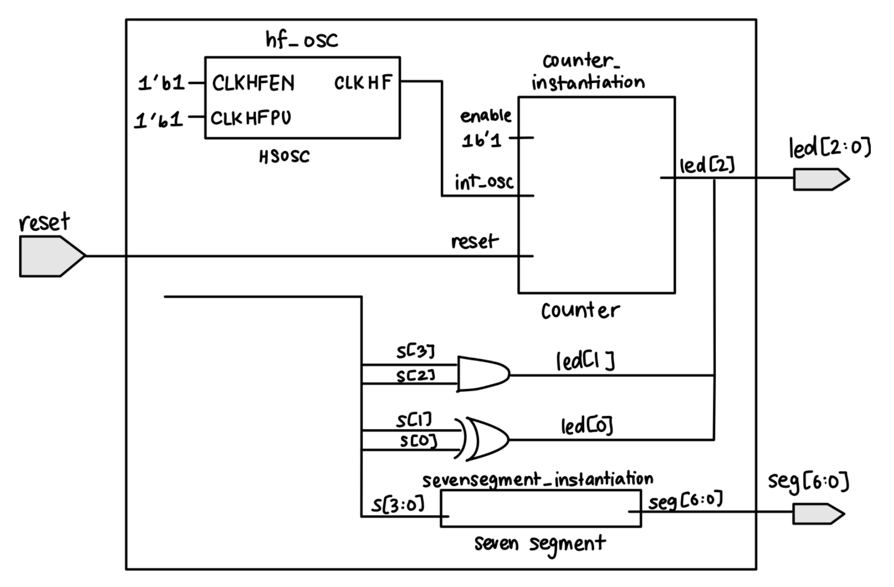
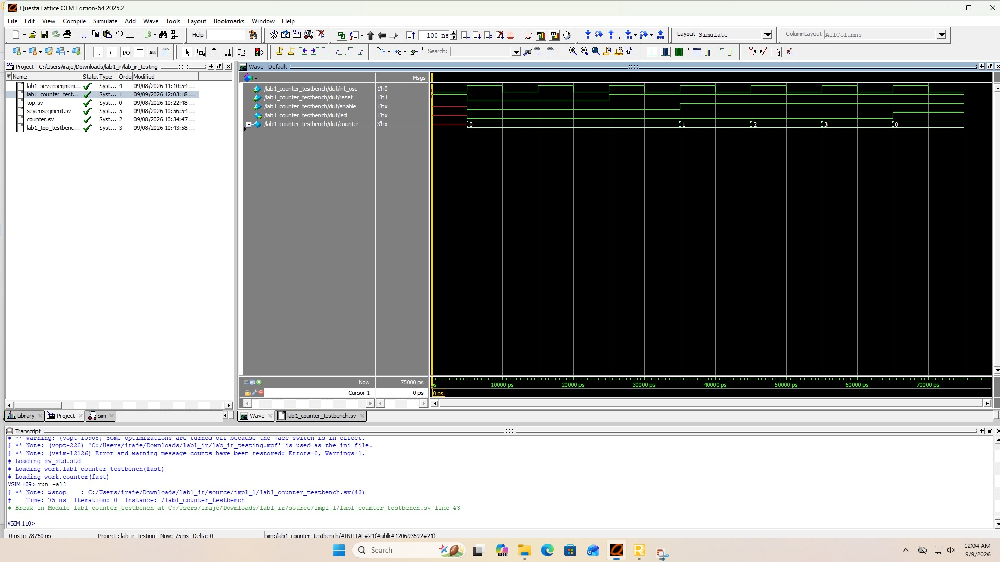
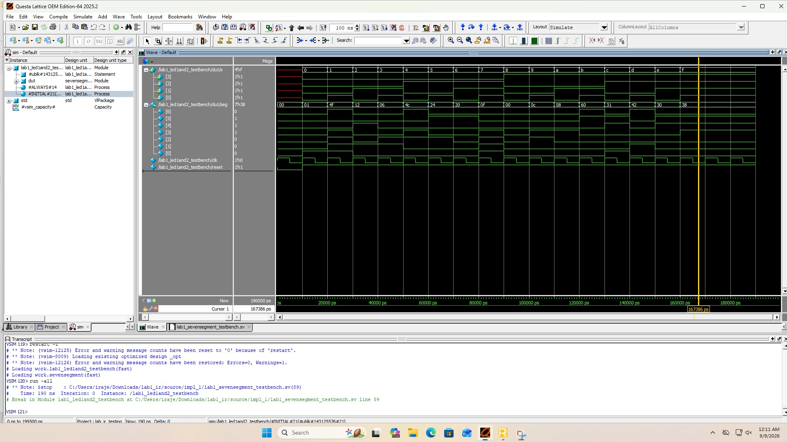
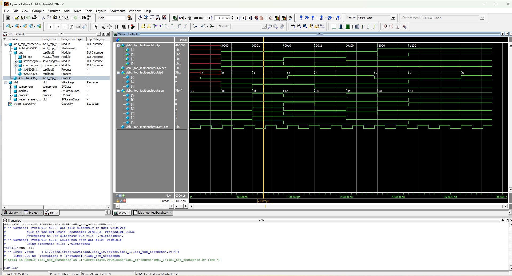

# Introduction  
In this lab, I set up the FPGA (Field-Programmable Gate Array) and MCU (Microcontroller Unit) and tested their functionality. The goal was to design a SystemVerilog-based FPGA system that used four DIP switches as inputs to control three LEDs and a seven-segment display. Combinational logic controlled two of the LEDs according to the specified logic operations and decoded the four-bit switch input for display as a hexadecimal digit on a common-anode seven-segment display. Sequential counter logic, driven by the FPGA’s internal high-speed oscillator (HSOSC), caused the third LED to blink at approximately 2.4 Hz. I simulated the design using QuestaSim before synthesizing and programming it using Lattice Radiant. Finally, I tested the design on the FPGA board to confirm that it functioned as expected.

# Design and Testing Methodology
## Development Board Assembly
The provided board 155 board was an empty PCB that was to be popularted with both Through Hpole Technology (THT) and Surface Mount Technology (SMT) components to form the fully assembled board (Figure 1). The various components that I had to solder were the resistors, capacitors, voltage regulator, DIP switches, push-button switches, jumpers, and LEDs. The board also contains the Nucleo-L432KC microcontroller unit (MCU) and the UPduino v3.1 FPGA which were the main components of the board.

Initial testing was done using to ensure that they were workinga nd able to communicate with one another. Lattice Radiant was used to program the FPGA to simply toggle a onboard LED at 1Hz using the HSOSC. The MCU was programmed using Segger Embeeded Studio to blink three other LEDs. After confirming that both the FPGA and MCU were working, I then moved on to designing the SystemVerilog modules.

Figure 1: My assembled board (left) with the MPU and FPGA, which are powered by the attached microUSB cable or an on-board power supply. Annotated image (right) showing the location ofvarious components of the board.

## FPGA Design and Verilog Structure
### Top-Level Module
The SystemVerilog was split into a top-level module and two submodules: one was for the combinational seven-segment display decoder and the other for the sequential counter which controlled led[2] and caused it to blink at 2.4Hz. The overall top module then instantiated both the submodules and the on-board high-speed oscillator (HSOSC) from the iCE40 UltraPlus primitive library. The top module also included the switch-to-led logic to control led[0] and led[1] based on the DIP switch inputs.

### Counter Module
Calculations were done to determine the expected number that the counter module would have to go uptil to acheive the desired flashing frequency of 2.4Hz (Period = 1/frequency = 1/2.4Hz = 0.4167s). This period needs account for the rise and fall of the LED, the counter must count for half of this period (0.4167s/2 = 0.2083s). Given the HSOSC frquency of 48MHz, the maxcount was calculated to be 48,000,000 * 0.2083s = 10,000,000. Hence, the counter was designed using the Verilog parameters with maxcount of 10,000,000 and width of 24 bits. After reaching this number, module then resets to zero and toggles led[2], achieving the frequency of 2.4Hz.

### Seven-Segment Display Module
The seven-segment display module was designed to decode the four-bit switch input s[3:0] and display the corresponding hexadecimal digit on the common-anode seven-segment display. More specifically, the design of the segment had to account for all numebr 1-9 and letters A-F having a unique display (for exampkle D and 0, thus a lower case d was used). For my module, seg[6] was the most significant bit and responded to A while seg[0] was the least significant bit and responded to G.

The common-anode display meant that the segments were turned on by driving them low, and off by driving them high. The module was designed using case statements with a default case to turn off all segments off when no input or reset is applied. 

## Use of Testbenches
Each module was tested individually in QuestaSim using testbenches before hardware testing. These simulated the DIP switch inputs and verified that the outputs (LEDs and seven-segment display) responded correctly according to the design specifications. After testing the submodules, the top-level module was also tested using a testbench to verify that the entire design functioned as expected.

# Technical Documentation
## GitHub Repository
The code for this lab is available on my GitHub repository: [Link to Github](https://github.com/iraje02/E155_MicroPs.git)

## Schematic Diagram

Figure 2: Schematic of FPGA design

## Block Diagram

Figure 3: Block diagram of FPGA design

# Results and Discussion
## Testbench Simulation Results
The counter module was tested using a automatic testbench by simulating the HSOSC clock and verifying that led[2] blinked at the expected frequency of 2.4Hz. The use of width and maxcount Verilog parameters allowed for easy adjustment of the counter and led[2]'s behavior for purposes of testing and waveform simulation. In addition to this, functionality of the reset, enable and max count features were also verified using the testbench.

  
Click to view the counter testbench

  
Figure 4: Waveform simulation of the counter module showing the reset and enable working. In this testbench, maxcount was set to 3, and led[2] toggled as desired after every 3 clock cycles.

The seven-segment display module was also tested using an automatic testbench that covered all 16 possible combinations of four DIP switch inputs. The testbench verified that each produced the correct hexadecimal digit.

  
Click to view the seven-segment testbench

  
Figure 5: Waveform simulation of the seven-segment display module showing the correct hexadecimal digit displayed for each DIP switch input combination ranging from 4'b0000 to 4'b1111.

Finally, the top module is also tested to check whether the connections to all submodules is working as desired. the iCE40 UltraPlus primitive library was also tested to check whether the HSOSC clock is working. 

  
Click to view the top testbench

  
Figure 6: Waveform simulation of the top module showing the correct behavior of the entire design, including toggling of led[2], connection between submodules given that seven-segment and internal HSOSC clock are working as desired, and also correct functioning of led[0] and led[1] based on the DIP switch inputs.

## FPGA Hardware Testing Results
After successful simulation of the design, the FPGA was programmed using Lattice Radiant to see if the desired LEDs and seven-segment display turned on as expected. The FPGA board is programmed with the .bin file that is generated after Design Synthesis of the top module. Pins were assigned to the DIP switch inputs s[3:0] and the outputs led[2:0] and seg[6:0] using the Lattice Radiant Pin Assignment tool.

Prior to testing, the seven-segment display HDSP-511C was connected to a breadboard and the pins were connected to the FPGA board using a ribbon cable. The seven segment LEDs were then wired in series with a current-limiting resistor to ensure that the current draw from the FPGA board was less than 200mA and that each diode was getting a current ~8mA. Given that it typically has a forward voltage drop of 2V, and the FPGA board provides 3.3V, the resistor value was calculated as R = (Vdd - Vf)/If = (3.3V - 2V)/0.008A = 162.5Ω. So a standard 160Ω resistor was used. 

# Conclusion
In conclusion, the FPGA and MCU were successfully set up and tested and the SystemVerilog design was implemented and tested through experimental and simulation methods. The design and modules made the SystemVerilog code more modular while the use of testbenches gave me and easy way to confirm code functionality before testing hardware. 

# AI Prototype Summary
For this AI prototype section, I prompted Claude's Sonnet 5 model using the prompt "Write SystemVerilog HDL to leverage the internal high speed oscillator in the Lattice UP5K FPGA and blink an LED at 2 Hz. Take full advantage of SystemVerilog syntax, for example, using logic instead of wire and reg." as instructed. The model generated the following code:

  
Click to view the SystemVerilog code generated by Claude Sonnet 5

//==============================================================================
// blink_led.sv
// Blinks an LED at 2 Hz using the Lattice iCE40 UP5K's internal
// high-speed oscillator (SB_HFOSC) — no external clock required.
//==============================================================================

module blink_led #(
    parameter real CLK_FREQ_HZ   = 12_000_000.0,  // HFOSC output freq (see CLKHF_DIV below)
    parameter real BLINK_FREQ_HZ = 2.0            // desired LED toggle rate
) (
    output logic led_o
);

    // HFOSC divider setting -> output frequency:
    //   "0b00" = 48 MHz   "0b01" = 24 MHz   "0b10" = 12 MHz   "0b11" = 6 MHz
    localparam string CLKHF_DIV = "0b10"; // 12 MHz, matches CLK_FREQ_HZ above

    // Number of clk cycles per half-period (toggle event)
    localparam int unsigned HALF_PERIOD_COUNT =
        int'(CLK_FREQ_HZ / (2.0 * BLINK_FREQ_HZ));

    // Width sized automatically from the computed count
    localparam int unsigned CNT_WIDTH = $clog2(HALF_PERIOD_COUNT);

    logic clk;
    logic [CNT_WIDTH-1:0] count;
    logic                 led_reg;

    //--------------------------------------------------------------------
    // Internal high-speed oscillator primitive
    //--------------------------------------------------------------------
    SB_HFOSC #(
        .CLKHF_DIV(CLKHF_DIV)
    ) u_hfosc (
        .CLKHFPU (1'b1),   // power up oscillator
        .CLKHFEN (1'b1),   // enable clock output
        .CLKHF   (clk)
    );

    //--------------------------------------------------------------------
    // Free-running divider + toggle flip-flop
    // iCE40 SRAM cells power up with a known state, so initial values
    // below set the configuration-time reset state (no external reset).
    //--------------------------------------------------------------------
    always_ff @(posedge clk) begin
        if (count == HALF_PERIOD_COUNT[CNT_WIDTH-1:0] - 1'b1) begin
            count   <= '0;
            led_reg <= ~led_reg;
        end else begin
            count <= count + 1'b1;
        end
    end

    initial begin
        count   = '0;
        led_reg = 1'b0;
    end

    assign led_o = led_reg;

endmodule

While I was surprised that the AI chatbot was able to understand the task of using the onboard high-speed oscillator to blink the LED at 2Hz, it chose to use the divider setting of 12MHz instead of the 48MHz that I had used in my design. It als had a lot more local paramters and a more complex design than I had used. Overall, I was impressed with the AI's ability to generate a working SystemVerilog code that met the requirements of the prompt and its well commented and explained code. 
